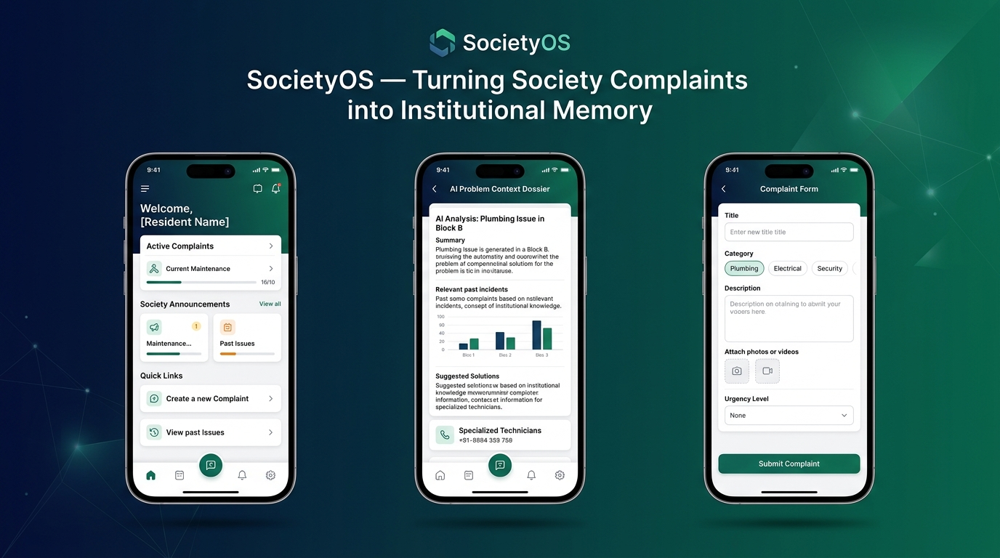
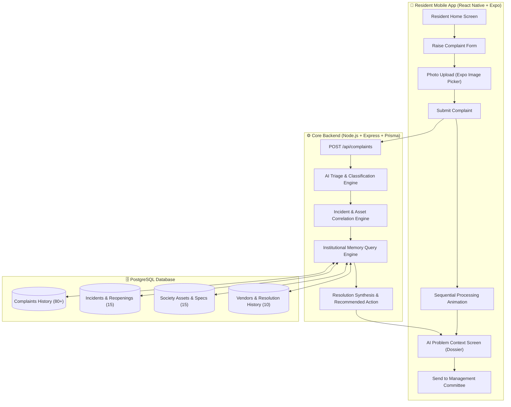
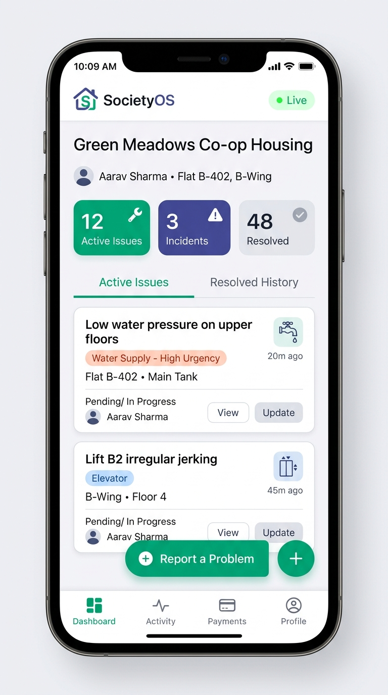
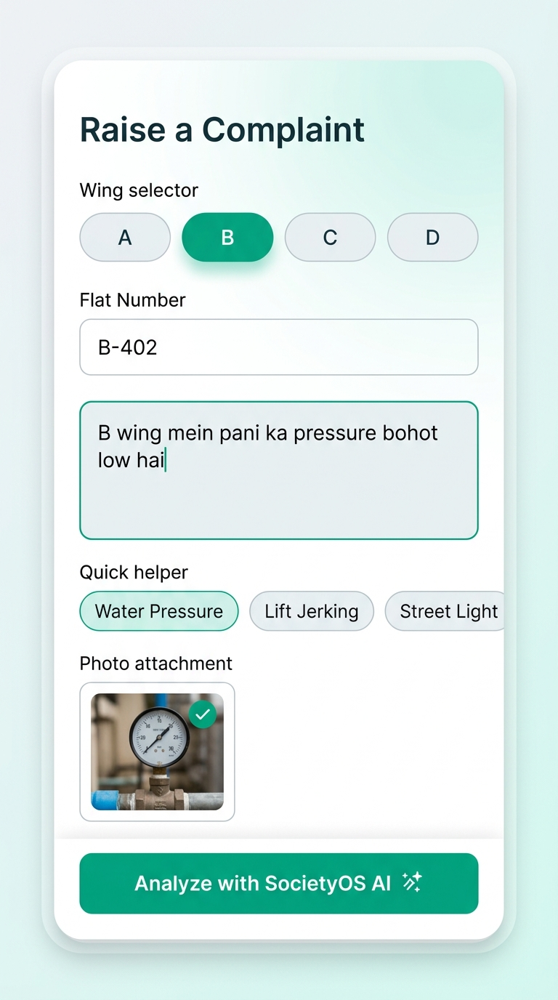
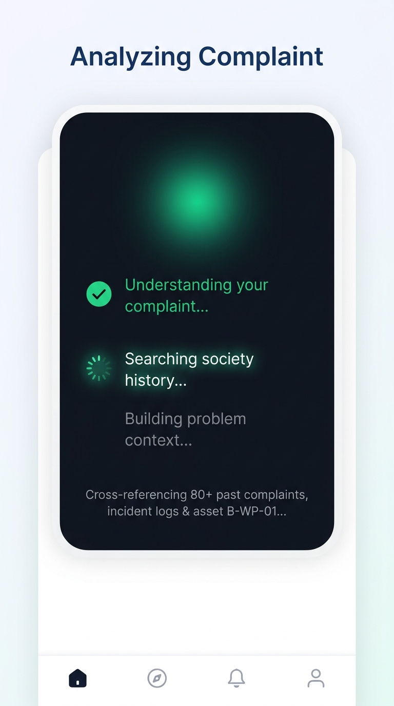
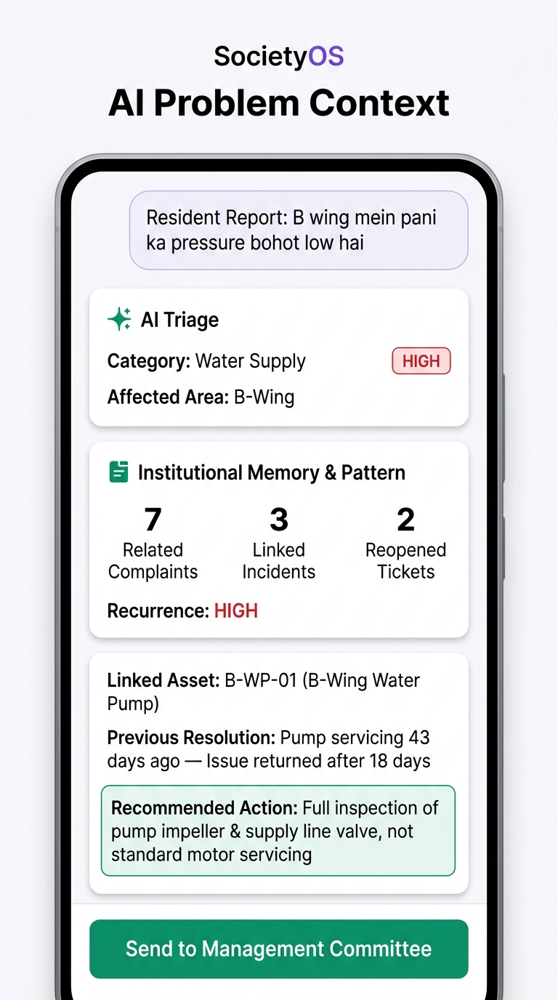

# SocietyOS 🏢
> **Intelligent Society Complaint & Institutional-Memory Platform**

[](https://github.com/rangeshsha-Rookie/SocietyOS)
[](LICENSE)
[](#)
[](https://reactnative.dev/)
[](https://www.typescriptlang.org/)
[](https://nodejs.org/)
[](https://www.prisma.io/)
[](https://www.postgresql.org/)
[](CONTRIBUTING.md)

<p align="center">
  
</p>

---

## 📌 Executive Summary

Traditional residential management apps operate like passive ticket dispatchers: every new complaint is treated in isolation. If a water pump or elevator breaks down for the fourth time in two months, standard apps simply dispatch another technician, discarding historical context, repeat failure cycles, and vendor warranty obligations.

**SocietyOS solves institutional amnesia.** It turns raw complaints into structured historical memory. When a resident reports an issue (in plain English or Hinglish), SocietyOS automatically cross-references historical maintenance records, asset health metrics, repeat incident frequency, and vendor resolution records to produce an actionable **AI Problem Dossier** before dispatching a work order.

---

## ⚡ The System Architecture



---

## ✨ Key Capabilities

1. **Natural Language Complaint Ingestion**
   - Residents report issues in natural conversational text (e.g., *"B wing mein pani ka pressure bohot low hai"*).
   - Instant input chips for fast testing and triage.
   - Evidence photo attachment via Expo Image Picker.

2. **AI Classification & Triage**
   - Automatically identifies category (Water Supply, Elevator, Electrical, Sanitation, Security).
   - Computes urgency rating (`LOW`, `MEDIUM`, `HIGH`, `CRITICAL`).
   - Extracts affected wing, flat number, and core issue tags.

3. **Asset & Incident Linking**
   - Correlates complaints to registered assets (e.g. `B-WP-01` — B-Wing Water Pump).
   - Aggregates related complaints across flats into a single active Incident cluster.

4. **Institutional Memory & Recurrence Detection**
   - Analyzes past interventions, time elapsed since last servicing, and repeat failure intervals (e.g. *"Issue returned after 18 days"*).
   - Alerts committee when repetitive repairs indicate an underlying systemic defect rather than a minor fix.

5. **Actionable AI Problem Dossier (Signature Screen)**
   - Delivers committee members an executive briefing card showing:
     - **Current Report**: Plain-text resident filing
     - **AI Triage**: Urgency & Category tags
     - **Correlation**: Total related complaints, active incidents, reopened tickets
     - **Recurrence Risk**: `HIGH` indicator
     - **Asset Details**: Name, type, and location
     - **Last Servicing**: Days elapsed and vendor outcome
     - **Recommended Action**: Data-backed recommendation (e.g. *"Inspect pump + supply line instead of basic motor servicing"*)

---

## 📱 Mobile App Screens & UI Showcase

<p align="center">
  
  &nbsp;
  
  &nbsp;
  
  &nbsp;
  
</p>
<p align="center">
  <em>(1) Resident Dashboard &nbsp;•&nbsp; (2) Complaint Ingestion &nbsp;•&nbsp; (3) AI Historical Cross-Reference &nbsp;•&nbsp; (4) Signature AI Problem Dossier</em>
</p>

| Screen | File Path | Description |
| :--- | :--- | :--- |
| **Resident Home** | `SocietyOS/mobile/app/index.tsx` | Dashboard displaying society status, live metrics, active/resolved tabs, and primary report button. |
| **Raise Complaint** | `SocietyOS/mobile/app/complaint.tsx` | Form for reporting issues with image picker, wing selector, test prompt chips, and Zod validation. |
| **Processing** | `SocietyOS/mobile/app/processing.tsx` | Smooth sequential animation simulating AI triage, historical search, and dossier compilation. |
| **AI Problem Context** | `SocietyOS/mobile/app/problem-context.tsx` | The flagship screen rendering the synthesized operational memory dossier and committee dispatch CTA. |

---

## 🛠 Tech Stack

### Mobile Application
- **Framework**: [React Native](https://reactnative.dev/) with [Expo SDK 51](https://expo.dev/)
- **Routing**: [Expo Router](https://docs.expo.dev/router/introduction/) (File-based navigation)
- **Language**: [TypeScript](https://www.typescriptlang.org/) (Strict configuration)
- **State Management**: [TanStack React Query v5](https://tanstack.com/query/latest)
- **Networking**: [Axios](https://axios-http.com/) with automatic emulator/LAN host fallback
- **Schema Validation**: [Zod](https://zod.dev/)
- **Media**: [Expo Image Picker](https://docs.expo.dev/versions/latest/sdk/imagepicker/)

### Backend & Database
- **Runtime**: [Node.js](https://nodejs.org/) (v20+ LTS)
- **API Framework**: [Express.js](https://expressjs.com/) with TypeScript
- **ORM**: [Prisma ORM](https://www.prisma.io/)
- **Database**: [PostgreSQL 15+](https://www.postgresql.org/)
- **AI Architecture**: Pluggable provider interface (`IAIProvider`) with mock provider for testing and seamless upgrade path to LLM + `pgvector`.

---

## 📂 Project Directory Structure

```
SocietyOS/
├── .github/
│   └── workflows/
│       └── ci.yml               # GitHub Actions CI (Typechecks & Builds)
├── .gitignore                   # Comprehensive ignore rules
├── CONTRIBUTING.md              # Contributor onboarding & PR guide
├── LICENSE                      # MIT Open-Source License
├── README.md                    # Project documentation
├── package.json                 # Root monorepo scripts
│
└── SocietyOS/
    ├── backend/                 # Node.js + Express + Prisma API
    │   ├── prisma/
    │   │   ├── schema.prisma    # PostgreSQL database schema
    │   │   └── seed.ts          # Seed script with realistic history
    │   ├── src/
    │   │   ├── index.ts         # Server entrypoint & Express routes
    │   │   └── lib/
    │   │       ├── ai/          # AI Provider interfaces & mock engine
    │   │       ├── db/          # Prisma client instance
    │   │       ├── incident/    # Incident correlation service
    │   │       └── memory/      # Operational memory synthesis service
    │   ├── .env.example         # Template environment variables
    │   ├── package.json         # Backend dependencies
    │   └── tsconfig.json        # TypeScript configuration
    │
    └── mobile/                  # React Native + Expo Application
        ├── app/                 # Expo Router screens
        │   ├── _layout.tsx      # Root stack navigation layout
        │   ├── index.tsx        # Resident Home screen
        │   ├── complaint.tsx    # Raise complaint screen
        │   ├── processing.tsx   # AI analysis loading screen
        │   └── problem-context.tsx # Signature AI Dossier screen
        ├── components/          # Reusable UI component library
        │   ├── AIContextCard.tsx
        │   ├── ActionButton.tsx
        │   ├── ComplaintCard.tsx
        │   ├── HistoryCard.tsx
        │   └── StatusCard.tsx
        ├── hooks/               # Custom React hooks (useComplaint)
        ├── services/            # API client and complaint service
        ├── types/               # TypeScript domain interfaces
        ├── app.json             # Expo application configuration
        └── package.json         # Mobile dependencies
```

---

## 🗄️ Database Schema & Seed Data

The Prisma schema defines a relational graph modeling complete housing society operations:

```
Resident (1) ───< (N) Complaint (N) >─── (1) Incident
                          │                     │
                          │                     v
                          └──────────> (1) Asset (N) >─── (1) Vendor
                                                │
                                                v
                                         (N) Resolution
```

### Pre-Seeded Dataset:
- **30 Residents** across Wings A, B, C, and D.
- **10 Registered Vendors** (Hydraulic pumps, electrical, Otis elevators, security).
- **15 Society Assets** (Water pumps, backup generators, lift units, fire systems).
- **15 Incidents** (including multi-tenant B-Wing water pressure failures with recurrence counters).
- **80 Historical Complaints** (featuring realistic complaint descriptions, resolution logs, and recurrence intervals).

---

## 🚀 Local Quickstart Guide

### 1. Prerequisites
- **Node.js** (v20 or higher)
- **PostgreSQL** running locally (or via Docker)
- **Git**
- Optional: **Expo Go** app on your iOS/Android phone

### 2. Clone the Repository
```bash
git clone https://github.com/rangeshsha-Rookie/SocietyOS.git
cd SocietyOS
```

### 3. Setup and Start Backend
```bash
cd SocietyOS/backend

# Install dependencies
npm install

# Configure environment variables
cp .env.example .env

# Push Prisma schema to your PostgreSQL database
npx prisma db push

# Seed realistic historical data
npx prisma db seed

# Launch development server (default port 3000)
npm run dev
```

### 4. Setup and Start Mobile App
Open a second terminal window:
```bash
cd SocietyOS/mobile

# Install dependencies
npm install

# Start the Expo Metro bundler
npm run start
```
- Press **`a`** to open in Android Emulator.
- Press **`w`** to open in web browser.
- Scan the on-screen QR code with **Expo Go** on your physical phone (ensure phone and PC are on the same Wi-Fi).

---

## 📡 REST API Reference

### 1. Submit and Analyze Complaint
- **Endpoint**: `POST /api/complaints`
- **Headers**: `Content-Type: application/json`

**Sample Request**:
```json
{
  "description": "B wing mein pani ka pressure bohot low hai",
  "wing": "B",
  "flatNumber": "B-402"
}
```

**Sample Response**:
```json
{
  "complaintId": "clx89a0bc000108l412345678",
  "aiAnalysis": {
    "category": "Water Supply",
    "urgency": "HIGH",
    "wing": "B",
    "issue": "Low water pressure"
  },
  "relatedComplaintsCount": 7,
  "incidentsCount": 3,
  "reopenedCount": 2,
  "recurrence": "HIGH",
  "relatedAsset": {
    "id": "asset-b-wp-01",
    "name": "B-Wing Water Pump (B-WP-01)",
    "type": "Water Pump",
    "location": "Basement B"
  },
  "lastIncidentDaysAgo": 43,
  "previousResolution": {
    "actionTaken": "Pump servicing",
    "outcome": "Issue returned after 18 days",
    "recurrenceDays": 18
  },
  "recommendedAction": "Inspect pump + supply line"
}
```

### 2. Fetch Active Complaints Feed
- **Endpoint**: `GET /api/complaints`
- **Response**: Array of registered complaints with resident and status metadata.

### 3. Healthcheck Endpoint
- **Endpoint**: `GET /health`
- **Response**: `{"status": "ok", "service": "SocietyOS API"}`

---

## 🧪 Acceptance Test Script

You can verify the backend correlation engine using PowerShell:

```powershell
$body = @{
  description = "B wing mein pani ka pressure bohot low hai"
  wing = "B"
  flatNumber = "B-402"
} | ConvertTo-Json

Invoke-RestMethod -Uri "http://localhost:3000/api/complaints" -Method Post -ContentType "application/json" -Body $body | ConvertTo-Json -Depth 5
```

---

## 🗺️ Roadmap & Future Architecture

- [x] **Sprint 1**: End-to-end vertical slice, Zod validation, Expo mobile UI, Prisma schema, historical correlation, and AI dossier signature screen.
- [ ] **Sprint 2**: Real-time push notifications via Expo Notifications for committee approval alerts.
- [ ] **Sprint 3**: Integration with Gemini API / OpenAI for multilingual Hindi/Marathi audio complaint transcription.
- [ ] **Sprint 4**: Vector embeddings using `pgvector` for semantic complaint deduplication across colloquial phrasing.
- [ ] **Sprint 5**: Vendor SLA tracker & automated escalation triggers.

---

## 👥 Authors & Maintainers

- **Rangesh** ([@rangeshsha-Rookie](https://github.com/rangeshsha-Rookie)) — *Lead Developer*
- Project repository: [https://github.com/rangeshsha-Rookie/SocietyOS](https://github.com/rangeshsha-Rookie/SocietyOS)

---

## 📄 License

This project is licensed under the MIT License — see the [LICENSE](LICENSE) file for details.